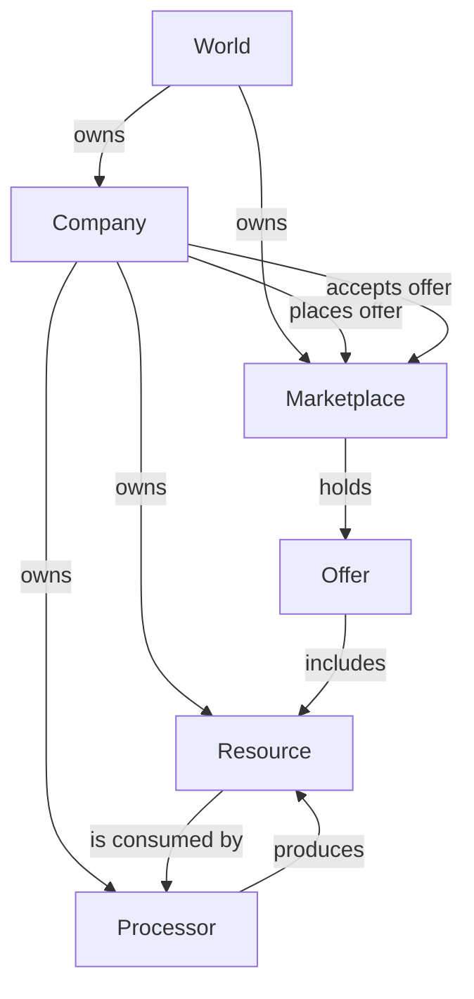

# EconoSim

Economy simulation written in Rust

# Basic Structure

Potential features:

- In- and outlux to the system
  - Basic resources must be placed into the market at (chaning?) rates
  - Sophisticated products must be consumed by end consumers
- Banking
  - Banks can lend money to customers
  - Banks get the money back with interest
  - Companys may fail with paying back
  - Banks may fail
- Shares
  - Companies can sell shares to get currency
  - Comapnies can be bought by other companies using shares
- AI agent
  - An AI agent controls a company
  - Agent success is measured with the following factors:
    - Company value:
      - All stock multiplied by current market value
      - Monopol bonus?
    - Current production rate
    - Currency influx
    - Currency

# Reinforment Learning

Observation Vector:

- Price index
- Order index
- Stock
- Currency
- Production rates?

Action Space:

- Buy processor
- Sell processor
- Create order
- Create offer
