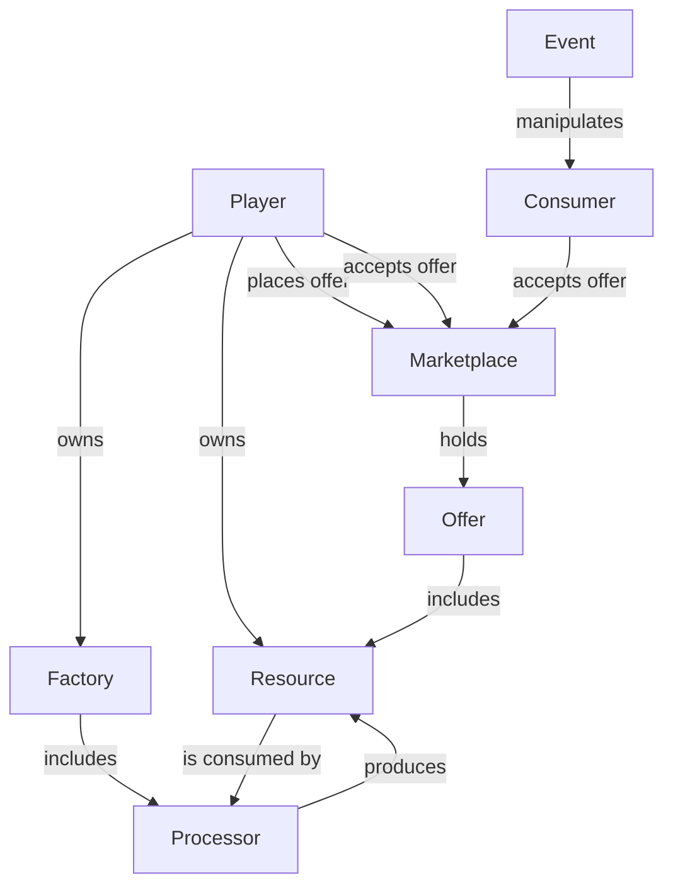

# EconoSim
Economy simulation written in Rust

# Basic Structure

```mermaid
graph TD;
    Marketplace-- holds -->Offer
    Player -- places offer -->Marketplace
    Player -- accepts offer -->Marketplace
    Player -- owns -->Factory
    Player -- owns --> Resource
    Factory -- includes --> Processor
    Processor -- produces --> Resource
    Resource -- is consumed by --> Processor
    Offer -- includes --> Resource
    Consumer -- accepts offer --> Marketplace
    Event -- manipulates --> Consumer
```
